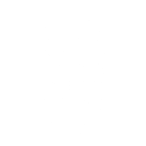

# ProjectPosedion

[Metamask](https://metamask.io/download/) Entegrasyonlu Güvenli Bulut Sistemi

Node.js teknolojisi kullanılarak yazılmış, verilerinizi basit ve güvenli bir şekilde tutabileceğiniz Metamask ile giriş yapılan merkeziyetsiz, güncel olarak Dünya'da en çok kullanılan AES (Advanced Encryption Standard) şifreleme standardı ile kullanıcının dosyalarını hem güvenilir bir şekilde tutmasını sağlayan hem de dosya alışverişinde hızlı olan bir bulut sistemi.

`Projenin canlı versiyonları için` 
http://poseidons.social 
https://projectposeidon.herokuapp.com 

Poseidon'un nasıl kullanıldığına aşağıdaki linkten ulaşabilirsiniz. 
https://www.youtube.com/watch?v=QM2UUox3sJ8

Poseidon'un teknik anlatımına aşağıdaki linkten ulaşabilirsiniz. 
https://www.youtube.com/watch?v=qWdXI9xTpuY&ab_channel=YusufAkba%C5%9F

Kaynak kodları referans alınıp geliştirecekler, Node.js için npm'in kurulu olup olmadığını kontrol edip belirtilen yolu izleyerek kaynak kodlarına erişip dilediğiniz gibi düzenleme yapıp deneyebilirsiniz. 

`git clone -> npm install -> npm start -> localhost:80`

Projeye katkısı bulunanlar; 
Yusuf AKBAŞ - Ekip Lideri, Full Stack Developer 
Osman Nuri Yağar - Full Stack Developer 
Murat Can Tunçel - Şifreleme, Dökümantasyon 
Emirhan Altunel - Şifreleme, Dökümantasyon 
Ahmet Furkan Bozkurt - Tester, Dökümantasyon 

Proje dökümanını YMGK_proje_dokumanından yada aşağıdaki linkten inceleyebilir.

https://drive.google.com/file/d/17MBk4ND7QX8Tnss4iWltMt1UIVj-0jbI/view  

`Yazılım Testi Yapılmadan Projenin Canlı Ortamlarda Kullanılması Tavsiye Edilmemektedir!` 

Proje ile ilgili iletişime geçebilirisiniz.
-> yusufakbas047@gmail.com
